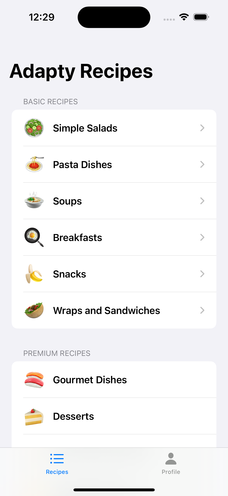
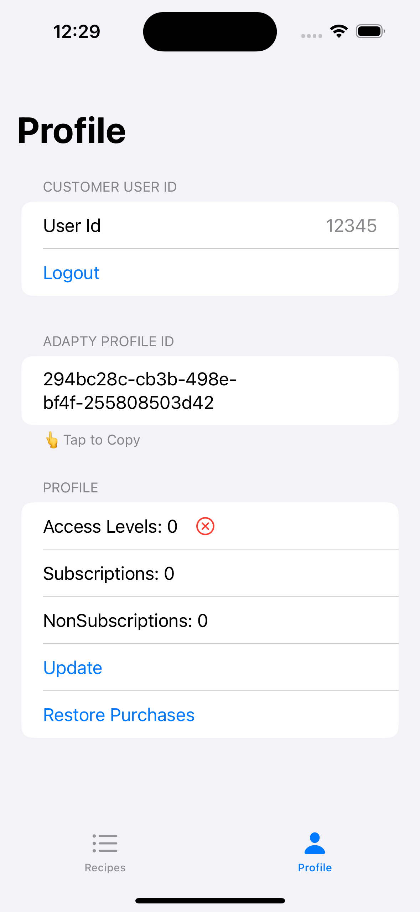

### AdaptyRecipes-SwiftUI Demo App

AdaptyRecipes-SwiftUI demo app is designed to show you how to work with Paywall Builder paywalls in Adapty. The app have minimal functionality, serving as both a tutorial and an example. The app is built with SwiftUI using Swift Package Manager for dependency management. If you need ademo app built with UIKit using CocoaPods for dependency management, refer to [AdaptyRecipes-UIKit demo app](../AdaptyRecipes-UIKit/README.md).

The app contains two tabs:

- **Recipes**: This tab simulates a real app interface. 

  - **Basic Recipes** are available to all users, even those without a subscription or paid access. 
  - **Premium Recipes**, on the other hand, are accessible only to paying users.   If a user without paid access tries to view a Premium Recipe, a paywall will appear. 
  
    

      </img>
    

  In Adapty terms, each subcategory in **Premium Recipes** is a placement. In the Adapty Dashboard, you can [configure which paywall will be shown in a given placement](https://app.adapty.io/placements). You can use a single placement for all subcategories if you have one subscription covering them all, or use separate placements if you have different subscriptions or non-subscription purchases for each subcategory.
- **Profile**: This is an auxiliary tab for testing purposes. Here, you can log in with different user accounts, each having different access levels, view and copy the profile ID to find the user in the [**Profiles**](https://app.adapty.io/profiles/users) section of the Adapty Dashboard, check how many subscriptions and non-subscription purchases the current user has, and more.

   

     </img>
   

